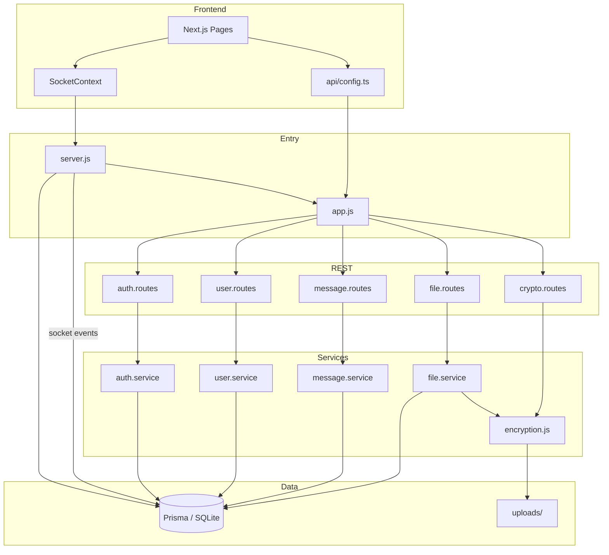
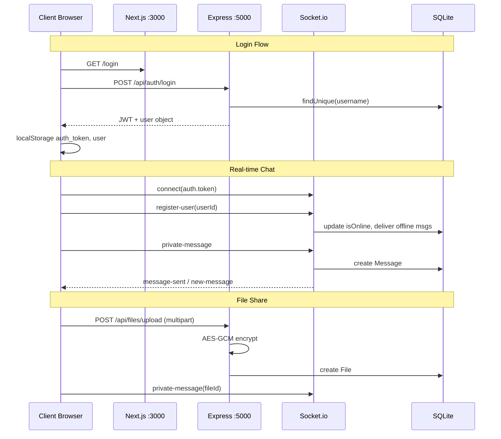

# TrustBridge — Phase 0 Code Audit Report

**Date:** 2026-06-23  
**Scope:** Full codebase (backend + frontend)  
**Constraint:** No breaking changes during Phase 0  

---

## Executive Summary

TrustBridge is a **functional LAN-based secure messaging prototype** with working username/password auth, 1:1 real-time chat (Socket.io), offline message delivery, AES-GCM encrypted file transfer, and partial role-based dashboards. It is **not yet enterprise-grade**: security controls are incomplete, permissions are duplicated/inconsistent, several modules are empty stubs, and Manager/Member lack dedicated dashboards.

**Overall readiness for Phase 0:** Suitable foundation; requires stabilization before Phase 1 feature expansion.

| Domain | Grade | Summary |
|--------|-------|---------|
| Architecture | C+ | Monolithic `server.js` owns all socket logic; empty module stubs |
| Security | C | JWT on REST only; messages plaintext; no rate limiting |
| Performance | B- | Fine for LAN prototype; no pagination indexes, no caching |
| Database | C+ | 4 models, no FK relations, no audit tables |
| API | B | 22 REST endpoints working; consistent `{ success, data }` pattern |
| UI | B- | Modern login + 3 role panels; Manager/Member share generic dashboard |

---

## 1. Architecture Report

### 1.1 Current Structure

```
TrustBridge/
├── backend/
│   ├── server.js              ← HTTP + Socket.io (199 lines, core real-time)
│   ├── src/app.js             ← Express mount + health
│   ├── src/config/            ← constants.js (ACTIVE), encryption.js, stubs
│   ├── src/modules/
│   │   ├── auth/              ← ACTIVE (4 files)
│   │   ├── user/              ← ACTIVE (4 files) + roles/ stubs
│   │   ├── messaging/         ← ACTIVE (3 files)
│   │   ├── file-transfer/     ← ACTIVE (3 files)
│   │   ├── crypto/            ← ACTIVE (encryption.js + routes)
│   │   └── websocket/         ← EMPTY stubs
│   ├── prisma/                ← schema + 7 migrations + seed
│   └── uploads/               ← encrypted files + .iv/.tag sidecars
└── frontend/
    └── src/
        ├── app/               ← 9 pages (App Router)
        ├── components/        ← ui/, layout/, chat/, providers/
        ├── context/           ← SocketContext (active), ChatContext (unused)
        └── lib/               ← api/, roles.ts, discoverServer.js (unused)
```

### 1.2 Dependency Map



### 1.3 Module Inventory

| Module | Path | Status | Lines of logic |
|--------|------|--------|----------------|
| Auth | `modules/auth/` | ✅ Active | Login, register, verify, JWT middleware |
| Users | `modules/user/` | ✅ Active | CRUD, reset password, creation rules |
| Messaging | `modules/messaging/` | ✅ Active | History, unread, conversations (read-only REST) |
| Files | `modules/file-transfer/` | ✅ Active | Upload/download/delete, RBAC |
| Crypto | `modules/crypto/` | ✅ Active | AES-256-GCM encrypt/decrypt |
| WebSocket | `modules/websocket/` | ❌ Empty | Logic in `server.js` |
| Middleware | `src/middleware/` | ❌ Empty | auth.js, error.js, zero-trust.js |
| Utils | `src/utils/` | ❌ Empty | logger.js, validators.js |
| Role stubs | `user/roles/*.js` | ❌ Empty | 5 files |

### 1.4 Refactoring Opportunities

1. **Extract socket handlers** from `server.js` → `chat/socket.handler.js` (keep event names)
2. **Unify permission rules** into single `roles/PermissionService`
3. **Remove dead code:** `ChatContext.jsx`, broken `websocket/socket.js`
4. **Activate** `discoverServer.js` on login page
5. **Implement** empty middleware stubs incrementally

### 1.5 Technical Debt

| Item | Severity | Effort |
|------|----------|--------|
| Role constant mismatch (kebab vs UPPER_SNAKE) | High | Low |
| Socket auth not verified | High | Medium |
| Messages stored plaintext | High | Medium |
| Mock audit logs in admin UI | Medium | Medium |
| No tests (0% coverage) | High | High |
| Empty docker-compose.yml | Low | Low |
| Duplicate permission logic (3 places) | Medium | Medium |

---

## 2. Security Report

### 2.1 Current Controls

| Control | Status | Location |
|---------|--------|----------|
| Password hashing (bcrypt) | ✅ | `auth.service.js` |
| JWT authentication (REST) | ✅ | `auth.middleware.js` |
| Role authorization (REST) | ✅ Partial | `authorize(['ADMIN', ...])` |
| AES-GCM file encryption | ✅ | `file.service.js` + sidecars |
| CORS `origin: *` | ⚠️ LAN-intentional | `app.js` |
| Socket JWT validation | ❌ | Token sent but never checked |
| Rate limiting | ❌ | — |
| Brute-force lockout | ❌ | — |
| CSRF | N/A (Bearer token API) | — |
| XSS sanitization | ❌ | Message content stored raw |
| Audit trail | ❌ | Mock UI only |
| Session revocation | ❌ | JWT valid until expiry |
| Input validation library | ❌ | Ad-hoc checks only |

### 2.2 Security Risks (Prioritized)

| # | Risk | Impact | Likelihood | Mitigation (Phase 0) |
|---|------|--------|------------|----------------------|
| R1 | Unauthenticated socket impersonation | Critical | High | `io.use()` JWT middleware |
| R2 | Plaintext messages in SQLite | High | Certain | Encrypt at rest (additive columns) |
| R3 | No login rate limit | High | Medium | `express-rate-limit` on `/auth/login` |
| R4 | `constants.js` role mismatch breaks `canCommunicate()` | Medium | High | Unify to UPPER_SNAKE |
| R5 | Admin mock audit logs imply compliance | Low | — | Real AuditLog table |
| R6 | JWT in localStorage (XSS theft) | Medium | Low | Document; httpOnly cookies in Phase 2 |
| R7 | No permission check on socket `private-message` | Critical | High | PermissionService in socket handler |

### 2.3 Password Storage

- ✅ Passwords hashed with bcrypt (cost 10)
- ✅ Admin reset uses hash, not plaintext storage
- ✅ No "view password" feature exists (correct per SRS)

---

## 3. Performance Report

### 3.1 Current Characteristics

| Area | Behavior | Bottleneck at scale |
|------|----------|---------------------|
| User list | Full table scan | 10k+ users |
| Messages | `findMany` with offset | Large histories |
| Files | Single 50MB multer buffer | Memory per upload |
| Socket | In-memory `connectedUsers` Map | Single server only |
| Frontend chat | Renders full message list | Long conversations |

### 3.2 Missing Optimizations

- Database indexes on `Message(senderId, receiverId, createdAt)`
- Cursor-based pagination
- Virtual scrolling in chat
- File chunking
- Redis for Socket.io horizontal scaling

### 3.3 LAN Performance (Adequate Today)

- Sub-100ms message delivery on LAN ✅
- `0.0.0.0` binding for multi-device access ✅
- Offline queue on reconnect ✅

---

## 4. Database Report

### 4.1 Tables (Prisma Models)

| Model | Fields | Relations | Indexes |
|-------|--------|-----------|---------|
| **User** | id, username, password, name, role, teamId, isOnline, lastSeen, timestamps | None (teamId is loose string) | username UNIQUE |
| **Team** | id, name, leadId, timestamps | None | — |
| **Message** | id, content, isEncrypted, senderId, receiverId, fileId, read, readAt, timestamps | None | — |
| **File** | id, filename, path, size, mimeType, isEncrypted, senderId, receiverId, timestamps | None | — |

### 4.2 Missing Tables (Phase 0 targets)

- `AuditLog`
- `SecurityEvent`
- `Notification`
- `Session` (optional Phase 0 lite)
- `Role` / `Permission` (or config-driven matrix in code first)

### 4.3 Migration History

7 migrations applied; latest: `replace_email_with_username`.

### 4.4 Data Integrity Issues

- No foreign keys → orphaned messages possible
- `Team` model unused in application logic
- `isEncrypted: true` on messages but content is plaintext

---

## 5. API Report

### 5.1 Complete Endpoint Inventory

#### Auth — `/api/auth`

| Method | Path | Auth | Body | Response |
|--------|------|------|------|----------|
| POST | `/register` | No | `{ username, password, name, role?, teamId? }` | 201 user |
| POST | `/login` | No | `{ username, password }` | `{ token, user }` |
| GET | `/verify` | Bearer | — | decoded JWT |

#### Users — `/api/users`

| Method | Path | Auth | Roles |
|--------|------|------|-------|
| GET | `/` | Yes | Any |
| GET | `/role/:role` | Yes | Any |
| GET | `/team/:teamId` | Yes | Any |
| GET | `/:id` | Yes | Any |
| POST | `/` | Yes | ADMIN, TEAM_LEAD |
| PUT | `/:id` | Yes | ADMIN, TEAM_LEAD |
| DELETE | `/:id` | Yes | ADMIN, TEAM_LEAD |
| POST | `/:id/reset-password` | Yes | ADMIN |

#### Messages — `/api/messages`

| Method | Path | Auth | Notes |
|--------|------|------|-------|
| GET | `/` | Yes | `?userId&limit&offset` |
| GET | `/unread/count` | Yes | — |
| GET | `/conversations` | Yes | — |
| PUT | `/:messageId/read` | Yes | — |

#### Files — `/api/files`

| Method | Path | Auth | Notes |
|--------|------|------|-------|
| GET | `/rules` | Yes | Sharing rules |
| GET | `/` | Yes | List files |
| POST | `/upload` | Yes | multipart 50MB |
| GET | `/download/:fileId` | Yes | Stream decrypted |
| DELETE | `/:fileId` | Yes | — |

#### Crypto — `/api/crypto`

| Method | Path | Auth |
|--------|------|------|
| GET | `/test` | Yes |
| GET | `/status` | Yes |
| POST | `/generate-key` | Yes |
| POST | `/encrypt` | Yes |
| POST | `/decrypt` | Yes |

#### System

| Method | Path | Auth |
|--------|------|------|
| GET | `/api/health` | No |

**Total: 22 REST endpoints** — all must remain backward-compatible.

### 5.2 WebSocket Events

| Direction | Event | Payload | Handler |
|-----------|-------|---------|---------|
| C→S | `register-user` | `userId` | server.js |
| C→S | `private-message` | `{ senderId, receiverId, content, fileId? }` | server.js |
| C→S | `typing` | `{ senderId, receiverId, isTyping }` | server.js |
| C→S | `mark-read` | `{ messageId, senderId, receiverId }` | server.js |
| C→S | `get-unread-count` | `userId` | server.js |
| S→C | `new-message`, `message-sent`, `message-saved`, `message-read`, `user-typing`, `user-online`, `user-offline`, `unread-count`, `message-error`, `user-error` | — | server.js |

---

## 6. UI Report

### 6.1 Pages

| Route | Role gate | Dashboard type | SRS compliance |
|-------|-----------|----------------|----------------|
| `/login` | Public | — | ✅ Modern split layout |
| `/dashboard` | All | Generic hub | ⚠️ Shared by Manager/Member |
| `/admin` | ADMIN | Control panel | ✅ Partial (mock audit) |
| `/admin/users` | ADMIN | User CRUD | ✅ |
| `/super-user` | SUPER_USER | Executive | ✅ Partial |
| `/team-lead` | TEAM_LEAD | Team mgmt | ✅ |
| `/chat` | Non-admin | WhatsApp-like | ⚠️ No typing UI, basic receipts |
| `/team-manager` | — | **Missing** | ❌ |
| `/team-member` | — | **Missing** | ❌ |

### 6.2 Design System Status

| Component | Exists | Location |
|-----------|--------|----------|
| Button, Input, Card, Modal, Badge, Alert | ✅ | `components/ui/` |
| Navbar (4 variants) | ✅ | `components/layout/Navbar.tsx` |
| RoleHero, StatCard, SecurityStrip | ✅ | `components/layout/`, `ui/` |
| Theme provider (dark/light) | ❌ | — |
| Skeleton loaders | ❌ | Only LoadingSpinner |
| Design system package | ❌ | — |
| Notification center | ❌ | Toast only |

### 6.3 Role Permission UI Gaps

- Admin sees Chat button on generic dashboard (SRS: Admin must not chat)
- Manager/Member lack dedicated navigation shells
- Permission text duplicated in `roles.ts` vs backend rules

---

## 7. Role Permissions (Current State)

### 7.1 Three Conflicting Sources

| Source | Role format | Used by |
|--------|-------------|---------|
| `config/constants.js` | kebab-case (`team-lead`) | `user.service.canCommunicate()` — **broken** |
| `user.service.js` CREATION_RULES | UPPER_SNAKE | User creation |
| `file.service.js` FILE_SHARING_RULES | UPPER_SNAKE | File upload |
| `frontend/chat/page.tsx` | UPPER_SNAKE inline | Contact filtering |
| `frontend/lib/roles.ts` | UPPER_SNAKE | UI labels |

### 7.2 Effective Permissions (DB-aligned, UPPER_SNAKE)

See `docs/PERMISSIONS.md` (generated with implementation plan).

---

## 8. LAN Communication Flows



### LAN Discovery (Not wired)

- `frontend/src/lib/discoverServer.js` probes `/api/health` on candidate IPs
- `fix-multi-router.sh` / `forward-ports.sh` for multi-subnet
- Env: `NEXT_PUBLIC_API_URL`, `NEXT_PUBLIC_WEBSOCKET_URL`, `NEXT_PUBLIC_SERVER_IP`

---

## 9. Scalability Issues

1. Single-process Socket.io (no Redis adapter)
2. SQLite single-writer limit
3. In-memory connected user map
4. No horizontal scaling path documented in code
5. Full user list fetched on every chat load

---

## 10. Phase 0 Recommendations Summary

| Priority | Action | Breaks existing? |
|----------|--------|----------------|
| P0 | Fix `constants.js` role format | No |
| P0 | Socket JWT middleware | No (additive) |
| P0 | AuditLog table + service | No (additive) |
| P0 | Team Manager/Member dashboards | No (new routes) |
| P0 | ThemeProvider dark/light | No |
| P1 | PermissionService centralization | No (wrapper) |
| P1 | Rate limiting on login | No |
| P1 | Notification table + API | No (additive) |
| P1 | Folder restructure with compat layers | No |
| P2 | Message encryption at rest | Dual-write migration |
| P2 | Test suite (Jest/Vitest) | No |

---

*End of Audit Report — Phase 0 baseline for implementation planning.*
