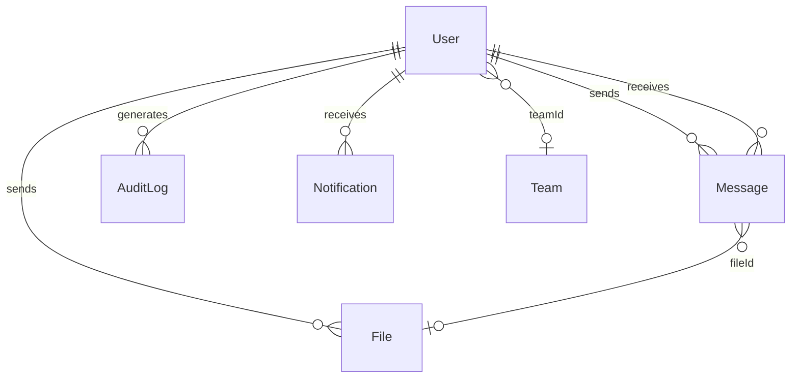

# TrustBridge — Database Documentation

## Current Schema (Phase 0 Baseline)

**Engine:** SQLite (`backend/prisma/dev.db`)  
**ORM:** Prisma 5.22

### User

| Column | Type | Constraints | Notes |
|--------|------|-------------|-------|
| id | String | PK, cuid | |
| username | String | UNIQUE | Login identifier |
| password | String | NOT NULL | bcrypt hash |
| name | String | NOT NULL | Display name |
| role | String | DEFAULT TEAM_MEMBER | UPPER_SNAKE enum string |
| teamId | String | NULLABLE | Loose FK to Team |
| isOnline | Boolean | DEFAULT false | |
| lastSeen | DateTime | DEFAULT now() | |
| createdAt | DateTime | AUTO | |
| updatedAt | DateTime | AUTO | |

### Team

| Column | Type | Notes |
|--------|------|-------|
| id | String | PK |
| name | String | |
| leadId | String | Optional Team Lead user id |
| createdAt, updatedAt | DateTime | |

**Usage:** Underutilized — team logic uses `User.teamId` only.

### Message

| Column | Type | Notes |
|--------|------|-------|
| id | String | PK |
| content | String | **Plaintext today** despite isEncrypted flag |
| isEncrypted | Boolean | DEFAULT true |
| senderId, receiverId | String | No FK |
| fileId | String | Optional link to File |
| read, readAt | Boolean, DateTime? | Read receipt |
| createdAt, updatedAt | DateTime | |

**Recommended indexes (Phase 0 migration):**
- `(receiverId, read)`
- `(senderId, receiverId, createdAt)`

### File

| Column | Type | Notes |
|--------|------|-------|
| id | String | PK |
| filename, path | String | Encrypted blob on disk |
| size, mimeType | Int, String | |
| isEncrypted | Boolean | DEFAULT true |
| senderId, receiverId | String | |
| createdAt, updatedAt | DateTime | |

---

## Phase 0 Additions (Additive Migrations Only)

### AuditLog

```prisma
model AuditLog {
  id          String   @id @default(cuid())
  userId      String?
  action      String   // LOGIN, LOGOUT, USER_CREATE, FILE_UPLOAD, etc.
  resource    String?  // userId, fileId, etc.
  ipAddress   String?
  userAgent   String?
  metadata    String?  // JSON string
  success     Boolean  @default(true)
  createdAt   DateTime @default(now())

  @@index([userId])
  @@index([action])
  @@index([createdAt])
}
```

### SecurityEvent

```prisma
model SecurityEvent {
  id          String   @id @default(cuid())
  userId      String?
  eventType   String   // FAILED_LOGIN, RATE_LIMIT, etc.
  severity    String   // low, medium, high
  details     String?  // JSON
  ipAddress   String?
  createdAt   DateTime @default(now())

  @@index([eventType])
  @@index([createdAt])
}
```

### Notification

```prisma
model Notification {
  id          String   @id @default(cuid())
  userId      String
  type        String   // message, file, mention, team, system
  title       String
  body        String?
  referenceId String?
  isRead      Boolean  @default(false)
  createdAt   DateTime @default(now())

  @@index([userId, isRead])
  @@index([createdAt])
}
```

### User extensions (Phase 0)

```prisma
// Add to User model:
isLocked      Boolean  @default(false)
isDisabled    Boolean  @default(false)
failedLogins  Int      @default(0)
lockedUntil   DateTime?
deletedAt     DateTime?  // soft delete (optional Phase 0)
```

---

## Migration Strategy

| Migration | Name | Risk | Rollback |
|-----------|------|------|----------|
| M8 | `add_audit_security_notification` | Low | Drop new tables |
| M9 | `add_user_lock_fields` | Low | Nullable defaults |
| M10 | `add_message_indexes` | Low | Drop indexes |

**Rules:**
- Never drop existing columns in Phase 0
- Never rename existing API-exposed fields
- Seed data preserved via `prisma migrate deploy`

---

## ER Diagram (Current + Phase 0)



---

*See `docs/PHASE0_IMPLEMENTATION_PLAN.md` for migration execution order.*
