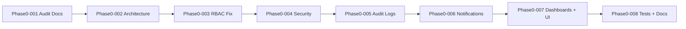

# TrustBridge — Phase 0 Implementation Plan

**Status:** AWAITING APPROVAL — No code changes until approved  
**Principle:** Backward compatibility at all times  
**Reference:** `docs/AUDIT_REPORT.md`, `docs/PERMISSIONS.md`, `docs/DATABASE.md`

---

## Approval Gate

Reply with **"Approve Phase 0"** to begin execution.  
Work proceeds in **8 atomic commits** (one per task group). Each commit is independently deployable.

---

## Dependency Map (Execution Order)



**Critical path:** RBAC fix → Security (socket auth) → Audit → UI dashboards

---

## Commit 1: `Phase0-001-Audit`

**Scope:** Documentation only (already partially done)

| File | Action |
|------|--------|
| `docs/AUDIT_REPORT.md` | ✅ Created |
| `docs/PERMISSIONS.md` | ✅ Created |
| `docs/DATABASE.md` | ✅ Created |
| `docs/PHASE0_IMPLEMENTATION_PLAN.md` | ✅ This file |

**Verification:** No runtime changes; `npm run build` unchanged.

---

## Commit 2: `Phase0-002-Architecture`

**Scope:** Folder structure + compatibility layers (no behavior change)

### Target Backend Layout

```
backend/src/
├── auth/                    # re-export from modules/auth/*
├── users/                   # re-export from modules/user/*
├── roles/
│   ├── PermissionService.js # NEW — single source of truth
│   ├── permissions.matrix.js
│   └── index.js
├── teams/                   # stub + TeamService wrapper
├── chat/
│   ├── socket.handler.js    # EXTRACT from server.js
│   └── index.js             # re-exports, same events
├── files/                   # re-export file-transfer/*
├── notifications/           # stub service
├── security/
│   ├── rateLimiter.js
│   ├── sanitize.js
│   └── socketAuth.js
├── audit/
│   ├── audit.service.js
│   ├── audit.middleware.js
│   └── audit.routes.js
├── network/                 # health + discovery helpers
├── database/
│   └── prisma.js            # shared PrismaClient singleton
├── shared/
│   ├── logger.js
│   └── errors.js
├── config/                  # keep existing
└── modules/                 # KEEP — thin wrappers call new paths
```

### Compatibility Strategy

```javascript
// modules/user/user.service.js — AFTER
const PermissionService = require('../../roles/PermissionService');
// canCommunicate delegates to PermissionService
// OLD exports unchanged
```

```javascript
// server.js — AFTER
const { registerSocketHandlers } = require('./src/chat/socket.handler');
registerSocketHandlers(io, prisma, connectedUsers);
// SAME event names, SAME payloads
```

### Frontend Layout (additive)

```
frontend/src/
├── ui/design-system/
│   ├── tokens.ts            # colors, spacing, role themes
│   ├── ThemeProvider.tsx
│   ├── Skeleton.tsx
│   └── index.ts
├── components/shells/
│   ├── AdminShell.tsx
│   ├── SuperUserShell.tsx
│   ├── TeamLeadShell.tsx
│   ├── TeamManagerShell.tsx
│   └── TeamMemberShell.tsx
└── app/team-manager/page.tsx  # NEW
└── app/team-member/page.tsx   # NEW
```

**Risk mitigation:**
- `modules/*` paths remain importable
- `app.js` route mounts unchanged
- Socket events unchanged

**Tests after commit:** Manual smoke — login, chat, file upload.

---

## Commit 3: `Phase0-003-RBAC`

**Scope:** Centralized PermissionService; fix role mismatch

### Changes

| File | Change |
|------|--------|
| `config/constants.js` | UPPER_SNAKE roles OR deprecate in favor of `roles/` |
| `roles/PermissionService.js` | `canCommunicate`, `canCreateUser`, `canShareFile`, `canAccessRoute` |
| `roles/permissions.matrix.js` | Data from `docs/PERMISSIONS.md` |
| `user.service.js` | Delegate to PermissionService |
| `file.service.js` | Delegate to PermissionService |
| `chat/page.tsx` | Import from `lib/permissions.ts` (mirrors backend) |
| `server.js` / socket handler | Check permission before `private-message` |

### Backward Compatibility

- API responses unchanged
- Denied socket messages return `message-error` (existing event)
- Frontend contact list may shrink to **correct** SRS set (bug fix, not breaking API)

### New Middleware

```javascript
// roles/permission.middleware.js
requirePermission('users:create')
```

Used only on **new** routes; existing `authorize(['ADMIN'])` kept.

---

## Commit 4: `Phase0-004-Security`

**Scope:** Harden without changing login contract

| Feature | Implementation | Breaking? |
|---------|----------------|-----------|
| Socket JWT auth | `io.use(async (socket, next) => verify(token))` | No — client already sends token |
| Rate limiting | `express-rate-limit` on POST `/api/auth/login` | No — only abusive clients affected |
| Brute force | Increment `failedLogins`; lock after 5 failures | No — new fields default safe |
| Input validation | `express-validator` on auth + user create | No — stricter validation only |
| XSS sanitize | `sanitize-html` on message content before save | No — strips scripts only |
| Helmet headers | `helmet` on Express | No |
| Password hashing | Keep bcrypt (argon2 optional Phase 1) | No |

### Login Response (UNCHANGED)

```json
{
  "success": true,
  "data": {
    "token": "...",
    "user": { "id", "username", "name", "role" }
  }
}
```

### New Endpoints (additive only)

| Method | Path | Purpose |
|--------|------|---------|
| POST | `/api/auth/logout` | Client logout + audit log |
| POST | `/api/users/:id/lock` | Admin lock |
| POST | `/api/users/:id/unlock` | Admin unlock |
| POST | `/api/users/:id/disable` | Admin disable |

---

## Commit 5: `Phase0-005-AuditLogs`

**Scope:** Real audit trail

### Database

- Migration `add_audit_security_notification` per `docs/DATABASE.md`

### Audit Service

Log events:

| Action | Trigger point |
|--------|---------------|
| LOGIN | auth.service login success |
| LOGOUT | auth logout endpoint |
| LOGIN_FAILED | auth login failure |
| PASSWORD_RESET | user reset-password |
| USER_CREATE | user create |
| USER_DELETE | user delete |
| USER_LOCK | user lock |
| FILE_UPLOAD | file controller |
| FILE_DOWNLOAD | file controller |
| MESSAGE_SENT | socket private-message |
| PERMISSION_DENIED | PermissionService denial |

### API (new, additive)

| Method | Path | Auth |
|--------|------|------|
| GET | `/api/audit/logs` | ADMIN |
| GET | `/api/audit/logs/search` | ADMIN `?action=&userId=&from=&to=` |

### Admin UI

- Replace mock audit table in `admin/page.tsx` with real API fetch
- Search/filter UI
- Keep mock data as fallback if API fails (dev resilience)

---

## Commit 6: `Phase0-006-Notifications`

**Scope:** Notification infrastructure foundation

### Database

- `Notification` model (see DATABASE.md)

### Service

- Create notification on: new message, file received, system events
- `GET /api/notifications` — paginated
- `GET /api/notifications/unread/count`
- `PUT /api/notifications/:id/read`
- `PUT /api/notifications/read-all`

### Socket (additive event)

- `notification` → client updates badge

### Frontend

- `NotificationProvider` + bell icon in Navbar
- Badge count from API + socket
- Desktop notification: `Notification.requestPermission()` on chat page
- Toast remains for real-time (existing)

**Existing SocketContext toast behavior preserved.**

---

## Commit 7: `Phase0-007-Dashboards-UI`

**Scope:** Five distinct dashboards + design system + dark mode

### New Pages

| Route | Shell | Nav items |
|-------|-------|-----------|
| `/team-manager` | TeamManagerShell (blue) | Overview, Team, Chat, Files |
| `/team-member` | TeamMemberShell (violet) | Chats, Files, Notifications |

### Dashboard Routing Update

`lib/roles.ts` → `getRoleHomePath()`:
- TEAM_MANAGER → `/team-manager`
- TEAM_MEMBER → `/team-member`

### Design System (`ui/design-system/`)

| File | Purpose |
|------|---------|
| `tokens.ts` | CSS variables, role accent colors |
| `ThemeProvider.tsx` | dark/light + `localStorage` persistence |
| `Skeleton.tsx` | Card, table, chat list skeletons |
| `Avatar.tsx` | Initials avatar + online dot |
| `MessageStatus.tsx` | ✓ sent / ✓✓ delivered / read |

### Dark Mode

- `class="dark"` on `<html>` via ThemeProvider
- Tailwind `darkMode: 'class'`
- Role-specific accent preserved in both themes

### Chat UI Enhancements (no API change)

- Wire typing indicator from SocketContext to chat page
- Message status ticks using existing `messageStatus` state
- File upload progress (already in FileSharing — polish UI)
- Skeleton on chat load

### Admin Dashboard

- Remove Chat button for ADMIN role
- Real audit log panel
- Security events widget

**Business logic unchanged — presentation only.**

---

## Commit 8: `Phase0-008-Tests-Docs`

**Scope:** Testing foundation + documentation pack

### Test Setup

**Backend:** Jest + supertest  
**Frontend:** Vitest + React Testing Library

```
backend/tests/
├── unit/permission.service.test.js
├── unit/audit.service.test.js
├── integration/auth.test.js
├── integration/users.rbac.test.js
├── integration/messages.test.js
├── security/rate-limit.test.js
└── lan/health.test.js

frontend/tests/
├── permissions.test.ts
├── ThemeProvider.test.tsx
└── shells/role-gates.test.tsx
```

**Target:** 80% on new Phase 0 modules; 60% overall (legacy untested code excluded initially).

### Documentation Pack

| File | Status |
|------|--------|
| `docs/PHASE0_REPORT.md` | Post-completion summary |
| `docs/ARCHITECTURE.md` | System design |
| `docs/SECURITY.md` | Threat model + controls |
| `docs/API.md` | All endpoints including new |
| `docs/DEPLOYMENT.md` | Local + LAN + Docker skeleton |
| `docs/CHANGELOG.md` | Phase 0 entries |

---

## Migration Plan (Database)

| Step | Command | When |
|------|---------|------|
| 1 | `prisma migrate dev --name add_audit_notification` | Commit 5 |
| 2 | `prisma migrate dev --name add_user_security_fields` | Commit 4 |
| 3 | `prisma migrate dev --name add_message_indexes` | Commit 8 |
| 4 | `npm run seed` | After each migration (idempotent) |

**Rollback:** Each migration is independent; `prisma migrate resolve` if needed.

---

## LAN Communication — Preservation Checklist

After every commit, verify:

- [ ] `GET /api/health` returns 200
- [ ] `POST /api/auth/login` with `admin`/`admin123`
- [ ] Socket connect + `register-user`
- [ ] Send `private-message` between two users
- [ ] Offline message delivery on reconnect
- [ ] `POST /api/files/upload` + download
- [ ] Admin user CRUD at `/admin/users`
- [ ] Team lead add member at `/team-lead`
- [ ] Frontend accessible at `:3000` from LAN IP

---

## Risk Register

| Risk | Mitigation |
|------|------------|
| Socket refactor breaks chat | Extract handler; keep identical event API; integration test |
| RBAC fix reduces visible contacts | Correct per SRS; document in CHANGELOG |
| Migration fails on existing DB | Additive columns only; test on copy of dev.db |
| Dark mode breaks role colors | Role tokens tested per shell |
| Rate limit blocks LAN testing | Whitelist `127.0.0.1` + configurable limit in `.env` |

---

## Estimated Effort

| Commit | Effort | Dependencies |
|--------|--------|--------------|
| 001 Audit | Done | — |
| 002 Architecture | 4–6 hrs | — |
| 003 RBAC | 3–4 hrs | 002 |
| 004 Security | 4–5 hrs | 003 |
| 005 Audit Logs | 4–5 hrs | 002, 004 |
| 006 Notifications | 3–4 hrs | 005 |
| 007 Dashboards UI | 8–10 hrs | 006 |
| 008 Tests Docs | 6–8 hrs | All |

**Total:** ~35–45 hours

---

## Deliverables Checklist (Post Phase 0)

- [ ] File-by-file change summary (`docs/PHASE0_REPORT.md`)
- [ ] New folder structure documented
- [ ] Database migration scripts (3 new)
- [ ] Permission matrix (`docs/PERMISSIONS.md`) ✅
- [ ] Security improvements list
- [ ] UI mockup descriptions
- [ ] Remaining work for Phase 1

---

## Phase 1 Preview (Out of Scope for Phase 0)

- Group chat / ChatRoom model
- Message reactions, reply, forward
- Chunked file upload
- Refresh tokens
- LAN auto-discovery UI + QR
- PostgreSQL production path

---

## Approval

To proceed, reply:

> **Approve Phase 0**

Execution will begin with `Phase0-002-Architecture` (commit 001 docs already created).

Each commit will be announced with summary before moving to next.

---

*TrustBridge Phase 0 — Stabilization & Foundation — Implementation Plan v1.0*
